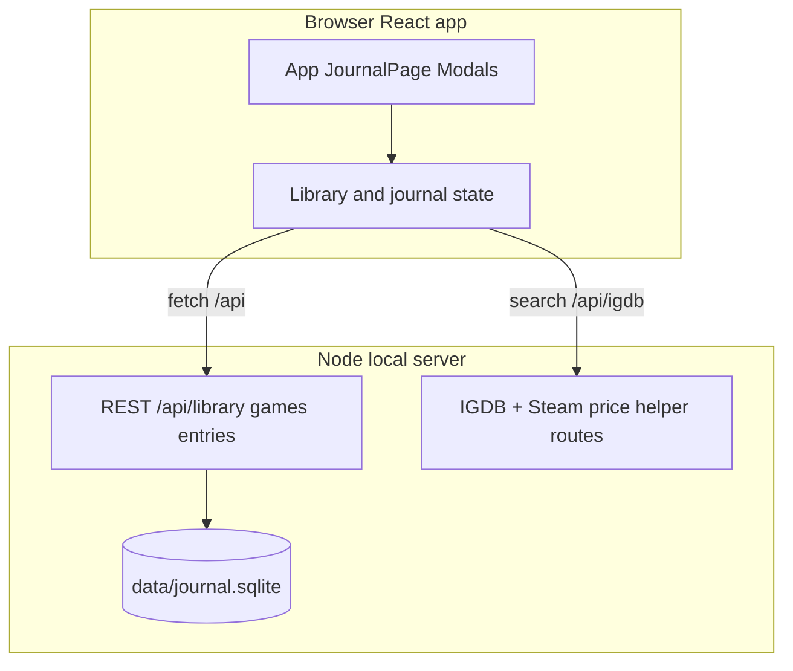

# Game Journal

A **narrative / story-game focused** journal: track sessions, moods, and notes per game, with **IGDB** for search and metadata. **Offline-first, private, local data** on your machine, **neon-style UI**, and a **SQLite** library plus persisted journal entries.

**Stack:** Vite + React + TypeScript, **Express** (`server/igdb-proxy.mjs`), **better-sqlite3** at `data/journal.sqlite`, REST under **`/api`**.

**New to the repo?** Follow **[`START.md`](./START.md)** for install, env vars, and dev commands.

For roadmap, distribution (friends / Electron), and AI-facing detail, see **[`agents.md`](./agents.md)** and **[`docs/distribution-gameplan.md`](./docs/distribution-gameplan.md)**.

## Architecture



- **Development:** `npm run dev` runs **Vite** and the **Node** server; Vite **proxies `/api`** to `http://localhost:3001` (configurable via `PORT` — see `vite.config.ts`).
- **IGDB** uses Twitch client credentials. If keys are missing, the server still starts; IGDB routes respond with **`igdb_not_configured`**; library/journal APIs keep working.
- **Electron** (installers for non-Git users) is a planned packaging step — see the distribution doc.

## Current capabilities (high level)

- **SQLite** schema for **games** (categories, progress, ratings, list price, etc.) and **journal entries**.
- **REST API** — `GET /api/library`, CRUD for `/api/games` and `/api/entries` (see `server/library-routes.mjs`).
- **IGDB** search, game details, health check; **store links from IGDB** and **Steam Store** live price when IGDB links a Steam app id (US region, Valve JSON API).
- **React UI** wired to real data (library, journal, IGDB detail flows — see `src/`).

## Getting started (short)

```bash
npm install
# Add TWITCH_CLIENT_ID + TWITCH_CLIENT_SECRET to .env or .env.local (optional for library-only)
npm run dev
```

Full steps, env table, and troubleshooting: **[`START.md`](./START.md)**.

## Roadmap (remaining / stretch)

Already in motion or done locally: SQLite, REST, Vite `/api` proxy, IGDB optional startup, core UI. Still evolving:

- **Production** — one command (`npm start` or similar) serving **`dist/`** + `/api` from a single Node process; document hosting.
- **Grading / polish** — UX for ratings, empty states, stats from real data only.
- **Friend installs** — in-app Twitch keys + **Electron** + installers (see distribution gameplan).
- **Recommendations / ML-style** suggestions when lists are sparse.
- **CI / Docker / observability** when you choose a target.

## Production (target)

Run **one Node process** that serves the **built** static app from `dist/` and mounts **library + IGDB** routes under `/api`. This is **not** wired as `npm start` yet — implement when you consolidate static + API in `server/`.

## Distribution: friends without Git

Desktop installer path (e.g. **Electron**), per-user Twitch keys, **Settings** instead of `.env` for end users — **[`docs/distribution-gameplan.md`](./docs/distribution-gameplan.md)**.

## License

Private project (`"private": true` in `package.json`).
