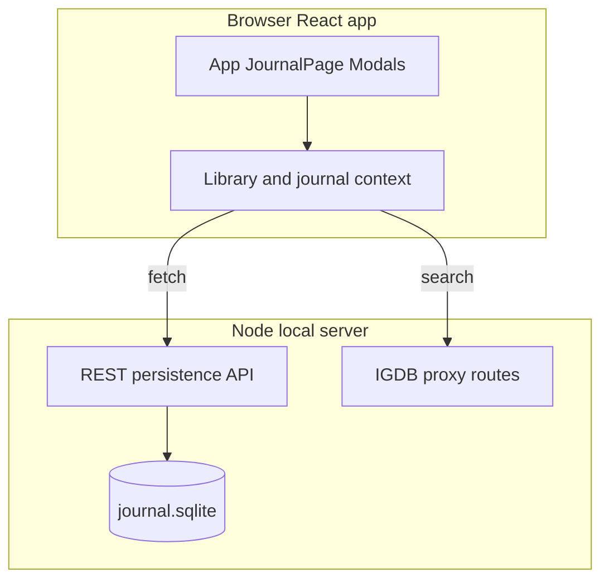

# Game Journal

A **narrative / story-game focused** journal: track sessions, moods, and notes per game, with **IGDB** for search and metadata. The product target is **offline-first, private, local data per machine**, a **neon-style UI** (largely in place from a Figma Make template), and **real persisted data** instead of mocks.

**Stack today:** Vite + React + TypeScript (web, not Electron). **Persistence (v1, planned):** SQLite at `data/journal.sqlite` via **better-sqlite3** in the existing Node server, exposed as **REST** — browsers cannot write arbitrary disk paths by themselves.

For **AI assistants** and detailed build priorities, see [`agents.md`](./agents.md).

## Architecture



- **React** loads library and journal state from `/api/…` after the SQLite layer exists.
- **Real-time UI:** after each successful API mutation, update React state (context or query client) so lists and counts refresh without a full page reload.
- **Electron** is an optional later packaging step (e.g. desktop `.exe`); the same persistence module could sit behind Electron’s main process. Not required for the current web codebase.

## Getting started

```bash
npm install
```

Configure IGDB credentials in a root **`.env`** (see project `.env.example` if present, or server expectations in `server/igdb-proxy.mjs`).

```bash
npm run dev
```

Runs **Vite** and the **Node IGDB proxy** together (`concurrently`). Once persistence lands, **Vite should proxy `/api`** (not only `/api/igdb`) to that same Node process so the app can call REST in dev.

## Roadmap (implementation order)

1. **SQLite + API + ignore user data** — `data/journal.sqlite`, better-sqlite3, REST on the Node server (extend or merge with `server/igdb-proxy.mjs`); add **`data/` to `.gitignore`**.
2. **React data layer** — context (or similar) with load/save and immediate UI updates after mutations.
3. **Remove mocks** — replace `mockGames`, hard-coded counts, and duplicate lists with API data; **empty states** per tab/section; **stats** from real data or honest placeholders (no fake numbers).
4. **IGDB game action menu** — click a search row to open a popover/dialog (e.g. Radix) with cover, name, rating (extend proxy fields / response); actions: **Add to wishlist**, **Start journal entry**, **Mark completed** (wired to API). Prefer a shared component + `onInspectGame` to keep `IgdbSearch` thin.
5. **Journal entries by `gameId`** — unify dashboard and `JournalPage` around persisted entries.
6. **Hygiene** — remove `setShowSearchSuggestions` dead code in `App.tsx`; one shared `igdbToGameCard` / mapper; Vite proxy for `/api`.
7. **Grading** — user grade on library games (e.g. stars), API persistence, surfaced on cards / headers / IGDB menu for games already in library.
8. **README + production notes** — document a single Node process serving **`dist/`** plus `/api` and IGDB routes.

## Deferred / lower priority

- **Recommendations / ML-style** fill for sparse sections (e.g. “recent games”) — after real data and empty states exist.
- **Electron** shell.
- **Docs dedup** — keep README for onboarding; keep `agents.md` as the living spec for agents.

## Production (target)

Run **one Node process** that serves the built static app from `dist/` and mounts **IGDB + persistence** routes under `/api` (exact shape TBD as the server is extended).

## License

Private project (`"private": true` in `package.json`).
